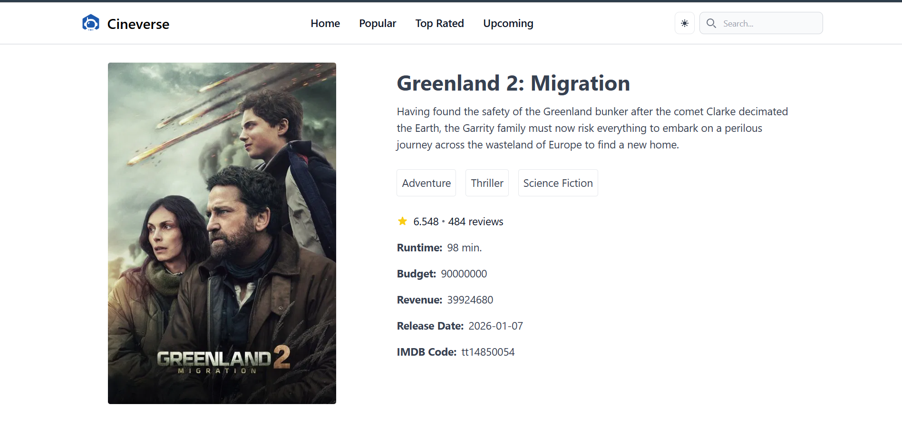

# 🎬 CINERVERSE

CINERVERSE is a modern movie-based web application built using React (Create React App).  
The project focuses on delivering a clean, responsive, and user-friendly interface for browsing and exploring movie-related content.

---

## 🚀 Features

- 🎥 Modern and attractive UI
- 📱 Fully responsive design
- ⚛️ Built using reusable React components
- 📂 Organized project structure
- ⚡ Fast development with Create React App
- 🔥 Easy to scale and customize

---

## 🛠️ Tech Stack

- React.js (Create React App)
- JavaScript (ES6+)
- HTML5
- CSS3

---

## 📦 Installation & Setup

Follow these steps to run the project locally:

### 1️⃣ Clone the repository

```bash
git clone https://github.com/Dharmendra110/CINERVERSE.git
```

### 2️⃣ Navigate to the project folder

```bash
cd CINERVERSE
```

### 3️⃣ Install dependencies

```bash
npm install
```

### 4️⃣ Start the development server

```bash
npm start
```

The app will run at:

```
http://localhost:3000
```

---

## 📜 Available Scripts

### `npm start`
Runs the app in development mode.  
The page will reload automatically when you make changes.

### `npm run build`
Builds the app for production in the `build` folder.  
Optimizes the project for best performance.

### `npm test`
Launches the test runner in interactive watch mode.

---

## 📂 Project Structure

```
CINERVERSE/
│
├── public/
├── src/
│   ├── components/
│   ├── pages/
│   ├── App.js
│   └── index.js
│
├── package.json
└── README.md
```

---

## 📷 Screenshots

To add screenshots:

1. Create a folder named `assets` inside your project.
2. Add your screenshot image inside it.
3. Use the following markdown format:

```

```

Example:



---

## 🔮 Future Improvements

- User authentication system
- Backend API integration
- Dynamic movie data fetching
- Reviews and ratings feature
- Cloud deployment

---

## 👨‍💻 Author

**Dharmendra Mahilange**  
GitHub: https://github.com/Dharmendra110

---

## 🤝 Contributing

Contributions are welcome!  
If you would like to improve this project, feel free to fork the repository and submit a pull request.

---

## ⭐ Support

If you like this project:

- Give it a ⭐ on GitHub
- Share it with others
- Follow for more projects

---

## 📄 License

This project is licensed under the MIT License.
